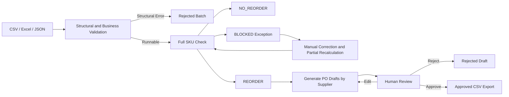

# Supplydesk — SME Procurement Agent

Supplydesk is an auditable procurement-preparation agent designed for small and medium-sized enterprise (SME) procurement teams. It consolidates fragmented inventory, demand, open purchase orders, supplier, and pricing data into a single workspace, checks each SKU individually, calculates replenishment recommendations, generates supplier-grouped purchase order drafts, and keeps final approval in the hands of procurement staff.

The project targets one of the most time-consuming and error-prone parts of daily procurement preparation: manually combining spreadsheets, overlooking early stockouts, using outdated prices, selecting unapproved suppliers, and being unable to explain how order quantities were calculated. Supplydesk lets the Agent handle data organization, calculations, and tracking, while procurement staff remain responsible for exception handling and final purchasing commitments.

> The current version supports multiple organizations and warehouse workspaces, with Purchasing Manager and Finance Manager approval stages. Each review remains single-warehouse and single-currency. Repository demo data is synthetic. The system does not connect to a real ERP, contact suppliers, or automatically issue purchase orders.

## Core Features

### 1. Multi-Source Procurement Data Import and Validation

Use **Data intake → Build dataset manually** to add goods, suppliers, commercial terms, inventory, demand and incoming orders directly in the browser. Records can be edited, duplicated or deleted. **Validate & create batch** saves the data and opens review-policy confirmation. **Edit as new batch** revises an earlier import while preserving its original evidence and approvals. The Agent reads the selected run created from this batch.

Selected upload files can be removed before validation. An unused or rejected import can also be deleted from Import history. Once an import has been used by a procurement review, it is retained as immutable audit evidence and the API explains why deletion is blocked.

The system supports six CSV files, an Excel workbook with six worksheets, or JSON data covering:

- SKU master data and safety stock policies
- Supplier master data
- Commercial mapping between SKUs and default suppliers
- Inventory snapshots
- Future and overdue open demand
- Open purchase orders not yet received

During import, the system checks for missing tables, duplicate primary keys, unknown SKUs, invalid dates, invalid quantities, placeholder text, and conflicting inventory data. Batches with structural errors are saved as `REJECTED` and display the specific issues. They are not treated as “zero inventory” or “zero demand” and passed into further calculations.

### 2. Full-SKU Replenishment Check

Each run creates a result for every valid SKU, ensuring that unchecked, evaluated, and blocked items are all visible. There are only three final statuses:

| Status | Meaning |
| --- | --- |
| `REORDER` | Projected inventory falls below the safety stock level, and the data is complete, allowing a replenishment recommendation to be generated. |
| `NO_REORDER` | Inventory levels remain at or above the safety stock level throughout the review period, so no order is required. |
| `BLOCKED` | Missing or conflicting data prevents the system from making a reliable decision and requires manual correction. |

The interface separately displays **Scan Coverage** and **Decision Completion Rate**. Even if some SKUs are blocked, the remaining SKUs can continue to be processed, while blocked items are excluded from purchase order drafts.

### 3. Explainable Deterministic Procurement Calculation

Procurement quantities are calculated entirely using deterministic business rules. The language model is not involved in quantity, date, or monetary calculations. The system creates inventory checkpoints at each demand date and at the end of the review period:

```text
projected_stock(day)
  = on_hand
  + open_po_arriving_on_or_before(day)
  - demand_due_on_or_before(day)

binding_point = Within the review period projected_stock The date with the lowest projected stock level

if binding_point.projected_stock < safety_stock：
  raw_order_qty = target_stock - projected_stock
  final_order_qty = Round up according to the MOQ and pack-size multiple.
then：
  NO_REORDER
```

This date-based calculation approach preserves short-term inventory gaps: late incoming purchase orders cannot hide stockouts that occur earlier. Each result stores the timeline, key dates, inventory levels, demand, incoming orders, supplier, price, MOQ, pack-size multiples, and lead-time evidence, allowing users to trace how the final recommendation was generated.

### 4. Exception Resolution and Partial Recalculation

Issues such as missing inventory, missing prices, missing default suppliers, unapproved suppliers, currency mismatches, stale data, and conflicting inventory snapshots are turned into explicit exception tasks. Procurement staff can correct the business context for a specific run through a form, after which the system recalculates only the affected SKUs while preserving the original imported data and the full revision history.

Lead-time risks and late incoming purchase orders are displayed as warnings, while missing or conflicting data that would compromise decision reliability prevents purchase order lines from being generated.

### 5. Purchase Order Drafting and Human Approval

All `REORDER` results are automatically grouped by supplier into purchase order drafts. Reviewers can inspect the supporting evidence, edit quantities and prices, approve or reject drafts, and export them as CSV files after approval.

The approval process has clear safety boundaries:

- The Agent and service credentials cannot approve purchase orders.
- Approval requires the reviewer to explicitly confirm the action and provide a comment.
- Version checks are used during approval to prevent an outdated page from approving a draft that has already changed.
- If there are critical changes to quantities, prices, supplier sources, or calculation results, any existing approval is automatically invalidated and the draft returns to `NEEDS_REVIEW`.
- Only drafts with `APPROVED` status can be exported.
- Each workspace owns its approval currency and finance-review threshold. The initial competition workspace uses SGD 5,000: drafts below it complete after Purchasing Manager approval, while drafts at or above it enter `FINANCE_REVIEW`. Owners can change the policy for their business entity; critical changes invalidate both approvals.

### 6. Agent Explanations and Complete Audit Trail

The Agent panel on the right is a multi-turn procurement chatbot powered by DeepSeek. Users can freely ask about SKUs, supplier spend, exceptions, PO drafts, historical changes, and policy scenarios in the current review. The model selects controlled read-only tools and analyzes the evidence returned from the database. The client sends at most the latest 10 conversation turns, and the model's private reasoning is never returned to the frontend.

The Agent receives tools for run overviews, SKU evidence, exceptions, drafts, the Decision Cockpit, read-only simulations, procurement rules, and page navigation. It receives no approval, rejection, export, or write tools. A price correction form opens only when the user explicitly supplies a concrete price; the model can never invent or save one.

Imports, checks, corrections, draft generation, edits, approvals, rejections, and exports are all recorded in the PostgreSQL audit log. The run context is frozen, ensuring that later imports cannot silently alter historical decisions.

### 7. Decision Cockpit and What-If Simulation

The management dashboard summarizes recommended procurement value, decision completion rate, approved value, supplier spend, and status or quantity changes compared with the previous run. Users can adjust demand ratios, safety and target stock ratios, review horizons, and supplier lead times to run read-only scenario simulations. The simulation reuses the same deterministic domain engine and does not modify source data, official runs, PO drafts, or approvals.

The Agent can generate a Daily Brief based on the current database state and explain material changes compared with the previous run. Daily Briefs use a deterministic local shortcut; other free-form questions are answered after DeepSeek selects read-only tools. Quantities and monetary values always come from persisted results returned by those tools.

## Workflow



## Design Principles

**Deterministic First.** All calculations that affect procurement commitments are handled by an independent domain engine. The same inputs always produce the same outputs, making it easier to test, review, and update business policies.

**Exceptions Are Never Silent.** The system does not guess missing prices, inventory levels, MOQ values, or supplier approval status. If a reliable decision cannot be made, the SKU is marked as `BLOCKED`, while unaffected SKUs continue to be processed.

**Humans Remain in the Critical Decision Loop.** The Agent can prepare and explain procurement actions, but it cannot approve orders on behalf of procurement staff. Any critical changes will trigger a new review.
**Persisted State Is the Source of Truth.** Both the frontend and the Agent read runs, evidence, draft versions, and audit events directly from the database. They do not claim that an operation has succeeded based solely on chat context.

**Recoverable and Duplicate-Safe.** After an interruption, the check resumes within the same run. Row-level locks, unique constraints, result revision numbers, and draft versions work together to prevent duplicate order lines and stale approvals.

## System Architecture

| Layer | Technology and Responsibilities |
| --- | --- |
| Web Application | React 19、TypeScript、Vite；Six pages: Overview, Import, SKU, Exceptions, Purchase Orders (PO), and Audit. |
| API | FastAPI；Authentication, input validation, standardized error responses, and static frontend hosting. |
| Agent | DeepSeek ReAct multi-turn tool loop; answers from persisted evidence, rules, and read-only simulation results. |
| Domain Engine | Python、Pydantic、Decimal；Deterministic inventory and replenishment calculations. |
| Data Layer | PostgreSQL、SQLAlchemy、Alembic；14 business tables, transactions, locks, and audit records. |
| Reasoning Model | DeepSeek thinking and tool calls; it cannot directly calculate commitments, write data, or approve orders. |

```text
frontend/          React frontend and Playwright browser tests
backend/api/       REST API and identity boundaries
backend/agent/     Agent orchestration and natural-language entry point
backend/domain/    Import normalization, data models, and procurement calculations
backend/skills/    Procurement workflows
backend/tools/     Atomic database operations, approvals, and auditing
backend/models/    SQLAlchemy table models
migrations/        Alembic database migrations
tests/             Domain, API, control, and PostgreSQL integration tests
biz module/        Business processes, rules, UAT, and measurement plans
demo/              Synthetic demo data safe for testing
```

## Quick Start

### Docker Compose

Requires Docker Engine:

```powershell
Copy-Item .env.example .env
docker compose up --build -d
docker compose exec api python -m backend.demo --date 2026-09-27
```

Open `http://localhost:8000`. The API documentation is available at `http://localhost:8000/docs`. Docker Compose waits for PostgreSQL to become ready, runs the database migrations, and then starts the API service with the frontend static files included.

### Local Development

Requires Python 3.12+, [uv](https://docs.astral.sh/uv/), PostgreSQL, and Node.js 22:

```powershell
uv sync --locked
Copy-Item .env.example .env
# Set `DATABASE_URL` in `.env`.
uv run alembic upgrade head
uv run python -m backend.demo --date 2026-09-27
uv run uvicorn backend.main:app --reload
```

Open a separate terminal and start the frontend:

```powershell
cd frontend
npm ci
npm run dev
```

Open `http://127.0.0.1:5173`. Vite proxies API requests to port `8000`. In production mode, run `npm run build` in the `frontend` directory and restart FastAPI. Both the frontend and backend will then be served through port `8000`.

## Demo Data

The `demo/` directory contains six CSV files, equivalent JSON data, and a sample run report. The fixed demo date is `2026-09-27`, with the following expected results:

```text
10 SKU / 3 suppliers
6 REORDER / 1 NO_REORDER / 3 BLOCKED
```

The frontend also provides three ready-to-run demo scenarios: standard procurement, a comparison of on-time versus delayed incoming purchase orders, and three exception-resolution cases. All currencies use the test code `XTS`, and all amounts are synthetic pre-tax data.

## Identity and Workspace Boundaries

The hosted application uses Supabase Auth. FastAPI verifies each bearer token against the project's JWKS endpoint, then resolves the selected `X-Workspace-ID` against server-side membership records. The sidebar workspace switcher only lists organizations and warehouses that the signed-in user may access.

| Workspace role | Permissions |
| --- | --- |
| Owner | Workspace settings, membership administration, procurement operations, purchasing and finance approval. |
| Procurement | Imports, checks, corrections, draft preparation, simulations, exports after approval, and Agent access. |
| Purchasing | Procurement permissions plus purchasing approval and rejection. |
| Finance | Read access plus finance approval or rejection when a draft reaches finance review. |
| Viewer | Read-only access to workspace procurement records and Agent evidence. |

Every import, run, SKU result, exception, PO draft, approval event and audit entry is resolved through its owning workspace. Each workspace also owns its business entity, warehouse, currency and finance-review threshold. Owners can edit those settings and delete an empty workspace; workspaces containing procurement history remain protected. Email invitations become active only for an authenticated user with the same verified email address.

Hosted users connect automatically through Supabase Auth. The Account panel retains editable API-key compatibility settings for local or legacy deployments, but the public backend keeps that mode disabled unless an administrator explicitly enables `ALLOW_API_KEYS`; provider secrets never enter the frontend bundle.

Local development can enable legacy `X-API-Key` credentials with `ALLOW_API_KEYS=true`; the hosted Render configuration disables them. DeepSeek reads `DEEPSEEK_API_KEY` or the Git-ignored `deepseek_api_key.txt` on the backend only. After updating an existing installation, run `uv run alembic upgrade head` before restarting the server.

## Testing and Current Status

```powershell
uv run pytest -q
uv run ruff check backend tests migrations
cd frontend
npm run build
$env:FRONTEND_URL='http://127.0.0.1:8000'
npm run test:e2e
```

The current version has passed:

- Backend and integration tests, including workspace isolation, membership role enforcement, configurable threshold boundaries, export gates and invalidation of both approvals
- 13 browser workflows including manual entry, editing, duplication/deletion, two-stage approval, export, chat navigation, and mobile layout
- TypeScript checks and Vite production build
- Alembic upgrade, downgrade, re-upgrade, and schema drift checks
- Visual checks at 1440px desktop and 390px mobile widths

Docker configuration is provided, but the image build has not yet been tested locally because a working Docker engine was unavailable on the development machine at the time. The DeepSeek tool loop is covered by mocked response tests and has also been verified once against the real API using the local synthetic procurement dataset.

For more detailed API and verification information, see the [API Documentation](docs/api.md), [Business Decision Records](docs/business-decisions.md), [Frontend Documentation](frontend/README.md), and [Verification Records](docs/verification.md).

## Project Scope

Each workspace represents one business entity and warehouse with its own currency, approval policy, SKU data, suppliers and procurement history. The MVP still uses a default-supplier strategy within each review. Exported files contain human-approved procurement preparation results and are not automatically sent to suppliers. Each run is independent; any remaining open purchase orders required for the next run must be explicitly provided in the new input data.

The project is implemented based on the process baseline, pain-point analysis, end-to-end scenarios, business rules, and measurement plan defined in the `biz module`. The current interface does not make unsupported claims about time savings, accuracy improvements, or return on investment; these metrics should be evaluated only after collecting real manual-process baselines and pilot-run data.
