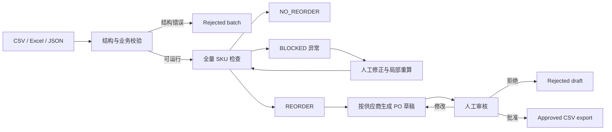

# Supplydesk — SME Procurement Agent

Supplydesk 是一个面向中小企业采购团队的可审计采购准备 Agent。它把分散的库存、需求、在途订单、供应商和价格数据汇总到一个工作区，逐一检查所有 SKU，计算补货建议，生成按供应商分组的采购单草稿，并把最终批准权留给采购人员。

项目针对的是日常采购准备中最耗时、也最容易出错的一段流程：手工拼接表格、漏看早期缺货、使用过期价格、误选未批准供应商，以及无法解释订单数量如何得出。Supplydesk 让 Agent 负责整理、计算和追踪，让人负责异常判断和采购承诺。

> 当前版本是单仓库、单币种、单审核人的 MVP。仓库中的公司、商品、金额和订单均为合成演示数据；系统不会连接真实 ERP、联系供应商或自动发出采购订单。

## 核心功能

### 1. 多源采购数据导入与校验

系统支持六份 CSV、六个工作表的 Excel 文件或 JSON 数据，覆盖：

- SKU 主数据和安全库存策略
- 供应商主数据
- SKU 与默认供应商的商业映射
- 库存快照
- 未来及逾期未履行需求
- 未收货采购订单

导入时会检查缺表、重复主键、未知 SKU、非法日期、无效数量、占位文本和冲突库存。结构错误的批次会被保存为 `REJECTED` 并展示具体问题，不会被当成“零库存”或“零需求”继续计算。

### 2. 全量 SKU 补货检查

每次运行都为每个有效 SKU 建立结果，因此未检查、已判断和被阻塞的商品都可见。最终状态只有三种：

| 状态 | 含义 |
| --- | --- |
| `REORDER` | 预测库存低于安全库存，数据完整，可以生成补货建议 |
| `NO_REORDER` | 检查周期内的库存水位满足安全库存，无需下单 |
| `BLOCKED` | 缺少或冲突的数据使系统无法可靠判断，需要人工修正 |

界面分别显示“扫描覆盖率”和“决策完成率”。即使部分 SKU 被阻塞，其余 SKU 仍可继续处理，而阻塞项不会进入采购单草稿。

### 3. 可解释的确定性采购计算

采购数量由纯业务规则计算，语言模型不参与数量、日期或金额运算。系统在每个需求日期以及检查周期终点建立库存检查点：

```text
projected_stock(day)
  = on_hand
  + open_po_arriving_on_or_before(day)
  - demand_due_on_or_before(day)

binding_point = 检查周期内 projected_stock 最低的日期

若 binding_point.projected_stock < safety_stock：
  raw_order_qty = target_stock - projected_stock
  final_order_qty = 按 MOQ 和包装倍数向上取整
否则：
  NO_REORDER
```

这种按日期计算的方式能够保留短期缺口：晚到的在途订单不会掩盖此前已经发生的缺货。每个结果都保存时间线、关键日期、库存、需求、在途、供应商、价格、MOQ、包装倍数和交期证据，用户可以追溯最终建议。

### 4. 异常修正与局部重算

缺少库存、缺少价格、默认供应商缺失、供应商未批准、币种不一致、数据过期和冲突快照等问题会形成明确的异常任务。采购人员可以在表单中修正指定运行下的业务上下文，系统只重算受影响的 SKU，并保留原始导入数据和修订历史。

交期风险和晚到在途订单作为警告展示；会破坏决策可靠性的缺失或冲突数据则阻止生成订单行。

### 5. 采购单草稿与人工审批

所有 `REORDER` 结果按供应商自动归并为采购单草稿。审核人可以检查来源证据、编辑数量和价格、批准或拒绝草稿，并在批准后导出 CSV。

审批具有明确的安全边界：

- Agent 和服务凭证不能批准采购单
- 批准必须由审核人显式勾选确认并填写意见
- 审批使用版本号校验，避免在旧页面上批准已经变化的草稿
- 数量、价格、供应商来源或计算结果发生关键变化后，已有审批自动失效并回到 `NEEDS_REVIEW`
- 只有处于 `APPROVED` 状态的草稿能够导出

### 6. Agent 解释与完整审计

右侧 Agent 面板可以解释已保存的判断、定位异常，并根据用户输入打开相应的修正表单。DeepSeek 只用于可选的自然语言意图识别；即使未配置模型，采购计算、异常判断和审批流程仍能完整运行。

导入、检查、修正、草稿生成、编辑、批准、拒绝和导出都会写入 PostgreSQL 审计记录。运行上下文会被冻结，后续导入不会悄悄改变历史结论。

## 工作流程



## 设计原则

**确定性优先。** 影响采购承诺的计算全部位于独立领域引擎中，相同输入得到相同结果，方便测试、复核和替换业务政策。

**异常不静默。** 系统不会猜测缺失价格、库存、MOQ 或供应商批准状态。无法可靠判断时返回 `BLOCKED`，同时继续处理不受影响的 SKU。

**人在关键回路中。** Agent 可以准备和解释，不能替采购人员批准订单。所有关键修改都会触发重新审核。

**存储状态是真实来源。** 前端和 Agent 都读取数据库中的运行、证据、草稿版本与审计事件，不凭聊天上下文声称操作成功。

**可恢复且防重复。** 中断后的检查会继续同一个运行；行锁、唯一约束、结果修订号和草稿版本共同防止重复订单行及过期审批。

## 系统架构

| 层 | 技术与职责 |
| --- | --- |
| Web 应用 | React 19、TypeScript、Vite；概览、导入、SKU、异常、PO 和审计六个页面 |
| API | FastAPI；认证、输入验证、统一错误响应和静态前端托管 |
| Agent | 可恢复的工作流编排；读取存储状态并选择下一步动作 |
| 领域引擎 | Python、Pydantic、Decimal；确定性库存与补货计算 |
| 数据层 | PostgreSQL、SQLAlchemy、Alembic；14 张业务表、事务、锁和审计 |
| 可选模型 | DeepSeek；仅解析自然语言意图，不计算或审批 |

```text
frontend/          React 前端与 Playwright 浏览器测试
backend/api/       REST API 与身份边界
backend/agent/     Agent 编排和自然语言入口
backend/domain/    导入规范化、数据模型和采购计算
backend/skills/    采购工作流
backend/tools/     数据库原子操作、审批和审计
backend/models/    SQLAlchemy 表模型
migrations/        Alembic 数据库迁移
tests/             领域、API、控制和 PostgreSQL 集成测试
biz module/        业务流程、规则、UAT 与衡量方案
demo/              可安全使用的合成演示数据
```

## 快速启动

### Docker Compose

需要 Docker 引擎：

```powershell
Copy-Item .env.example .env
docker compose up --build -d
docker compose exec api python -m backend.demo --date 2026-09-27
```

打开 http://localhost:8000；API 文档位于 http://localhost:8000/docs。Compose 会等待 PostgreSQL 就绪、执行迁移，再启动包含前端静态文件的 API 服务。

### 本地开发

需要 Python 3.12+、[uv](https://docs.astral.sh/uv/)、PostgreSQL 和 Node.js 22：

```powershell
uv sync --locked
Copy-Item .env.example .env
# 在 .env 中设置 DATABASE_URL
uv run alembic upgrade head
uv run python -m backend.demo --date 2026-09-27
uv run uvicorn backend.main:app --reload
```

另开终端启动前端：

```powershell
cd frontend
npm ci
npm run dev
```

打开 http://127.0.0.1:5173。Vite 会把 API 请求代理到 8000 端口。生产模式下，在 `frontend` 运行 `npm run build` 后重启 FastAPI，即可由 8000 端口统一提供前后端。

## 演示数据

`demo/` 包含六份 CSV、等价 JSON 和一次运行报告。固定演示日期为 `2026-09-27`，预期结果为：

```text
10 SKU / 3 suppliers
6 REORDER / 1 NO_REORDER / 3 BLOCKED
```

前端还提供三个可直接运行的故事：标准采购、及时与延迟在途对比、三类异常修正。所有币种使用测试标识 `XTS`，金额为税前合成数据。

## API 身份边界

所有 `/api/v1` 接口要求 `X-API-Key`：

| 身份 | 环境变量 | 权限 |
| --- | --- | --- |
| 服务 / Agent | `API_KEY` | 导入、检查、生成草稿、查询、导出已批准草稿 |
| 人工审核人 | `REVIEWER_API_KEY` | 服务权限 + 修正来源、编辑草稿、批准和拒绝 |

两种 Key 必须不同。演示默认值位于 `.env.example`，对外部署前必须更换并启用 HTTPS。DeepSeek 密钥只由后端读取，可通过 `DEEPSEEK_API_KEY` 或被 Git 忽略的 `deepseek_api_key.txt` 配置，绝不能放入前端变量或仓库。

## 测试与当前状态

```powershell
uv run pytest -q
uv run ruff check backend tests migrations
cd frontend
npm run build
$env:FRONTEND_URL='http://127.0.0.1:8000'
npm run test:e2e
```

当前版本已通过：

- 70 项 PostgreSQL 后端与集成测试
- 9 条真实 API 浏览器端到端流程
- TypeScript 检查和 Vite 生产构建
- Alembic 升级、降级、重新升级与 schema drift 检查
- 1440px 桌面端和 390px 移动端视觉检查

Docker 配置已经提供，但由于开发机当时没有可用 Docker 引擎，镜像构建尚未在本机实测。DeepSeek 行为通过替身响应测试，没有消耗真实模型调用。

更详细的接口与验证信息见 [API 文档](docs/api.md)、[业务决策记录](docs/business-decisions.md)、[前端说明](frontend/README.md) 和 [验证记录](docs/verification.md)。

## 项目边界

本 MVP 采用单仓库、单币种和默认供应商策略。导出的文件是经过人工批准的采购准备结果，不会自动发送给供应商。不同运行相互独立；下一次运行所需的剩余在途订单应由新的输入数据明确提供。

项目依据 `biz module` 中的流程基线、痛点分析、端到端场景、业务规则和衡量方案实现。当前界面不会虚构节省时间、准确率或投资回报；这些指标需要通过真实的人工基线与试运行数据后再评估。
